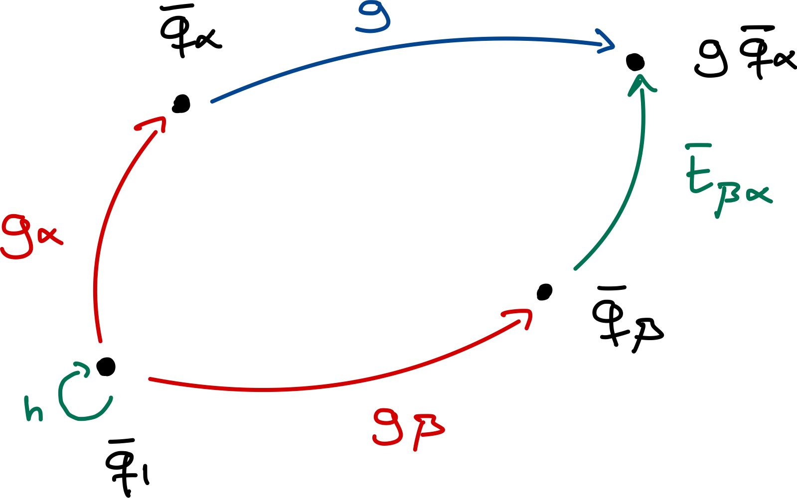

# Theory Notes

This package heavily relies on [representation theory of groups](https://en.wikipedia.org/wiki/Representation_theory_of_finite_groups) and on [band theory](https://en.wikipedia.org/wiki/Electronic_band_structure) of crystals. Almost all of this theory was introduced before and can be found in [Bradley & Cracknell](https://academic.oup.com/book/54787) and later developed by [Bradlyn *et al.*](https://www.nature.com/articles/nature23268). Here, we aim to provide a practical introduction to the main concepts and derive the essential functions and relations that we need for the implementation of this package. Additionally, we generalize some of the previously derived results and make them more accessible to the general public.

## Table of contents

- [Theory Notes](#theory-notes)
  - [Table of contents](#table-of-contents)
  - [Introduction](#introduction)
  - [Transformation properties of orbitals](#transformation-properties-of-orbitals)
    - [Transformation properties of induced Bloch functions](#transformation-properties-of-induced-bloch-functions)
  - [Build a tight-binding Hamiltonian from a set of symmetric orbitals](#build-a-tight-binding-hamiltonian-from-a-set-of-symmetric-orbitals)
    - [Transformation properties under symmetry operations](#transformation-properties-under-symmetry-operations)
    - [Transformation properties under time-reversal symmetry](#transformation-properties-under-time-reversal-symmetry)
    - [Transformation properties of the Bloch states](#transformation-properties-of-the-bloch-states)
      - [Transformation properties under lattice translations](#transformation-properties-under-lattice-translations)
      - [Transformation properties under symmetry operations](#transformation-properties-under-symmetry-operations-1)
  - [Implementing Symbolic Hamiltonians in Non-Symbolic Environments](#implementing-symbolic-hamiltonians-in-non-symbolic-environments)
    - [Symmetry constraints in the numerical matrix $𝐌^{αβ}\_{ij}$](#symmetry-constraints-in-the-numerical-matrix-𝐌αβ_ij)
    - [Time-reversal constraint in the numerical matrix $𝐌$](#time-reversal-constraint-in-the-numerical-matrix-𝐌)
  - [Appendix A](#appendix-a)
    - [Transformation properties within Convention 2](#transformation-properties-within-convention-2)
    - [Bloch Hamiltonian under Convention 2](#bloch-hamiltonian-under-convention-2)
      - [Bloch states under Convention 2](#bloch-states-under-convention-2)
        - [Transformation under lattice translations](#transformation-under-lattice-translations)
        - [Transformation properties under symmetry operations](#transformation-properties-under-symmetry-operations-2)
    - [Conversions between Convention 1 and 2](#conversions-between-convention-1-and-2)
  - [Appendix B](#appendix-b)


## Introduction

The introduction of [Topological Quantum Chemistry](https://www.nature.com/articles/nature23268) (TQC) established a link between trivial insulators and atomic limits. It states that if a set of isolated bands can be described by a set of isolated — atomic-like — orbitals, the set must be topologically trivial. This link is determined by first analyzing all band symmetries of these "atomic-like" orbitals. Then, the set of bands under study will be nontrivial if it does not fit into that list.

The analysis of the band symmetries of the isolated orbitals can be performed by placing localized, symmetric orbitals at some high-symmetry points $𝐪_α$ — [Wyckoff positions](https://en.wikipedia.org/wiki/Wyckoff_positions) — with some internal symmetry — corresponding to a particular site-symmetry irrep $ρ$. Those orbitals can be labeled as $ϕ_{αi}(𝐫)$, where $i$ runs over the dimension of the irrep $ρ$, or just by $(𝐪_α|ρ)$. By applying the Fourier transform, the induced Bloch functions can be obtained as:

```math
φ_{αi,𝐤}(𝐫) = \sum_𝐭 e^{i𝐤·𝐭} ϕ_{αi}(𝐫-𝐭)
```

How $φ_{αi𝐤}(𝐫)$ transforms under symmetries will define a [band representation](https://journals.aps.org/prb/abstract/10.1103/PhysRevB.23.2824).

The idea behind this package is to use these orbitals to build a tight-binding model that respects the symmetries and topology of the (trivial) set of bands whose band representation is matched by such a set of orbitals.

To do so, it is necessary to access all possible types of symmetry-independent orbitals and high-symmetry points in every space group. Luckily, this was tabulated by [Bradley & Cracknell](https://academic.oup.com/book/54787) and implemented in the Julia package [Crystalline.jl](https://github.com/thchr/Crystalline.jl). This package depends on the latter package to access that information.

Now that the basic framework has been established, in the following sections we deduce how these functions transform and how they can be used to build a symmetric tight-binding model.

## Transformation properties of orbitals

Let us assume we have identified a set of orbitals that describe the band structure of a trivial set of bands. This can be achieved through a TQC analysis of the bands, and several tools exist to perform such a decomposition. For example, the package [PhotonicTightBinding.jl](https://github.com/AntonioMoralesPerez/PhotonicTightBinding.jl) provides this functionality for photonic bands.

> [!NOTE]
> For instance, Graphene's two *p*<sub>*z*</sub> orbitals sit at the 2b Wyckoff position. Although these orbitals are odd (i.e., changing sign) under mirror in the out-of-plane direction, they are even (i.e., invariant) under all in-plane symmetries, including rotations and mirrors. The corresponding site-symmetry irrep is the A₁ irrep of the 2b Wyckoff position. Thus, these orbitals can be expressed as (2b|A₁). However, take into account that not all band representations can be induced from a set of atomic (electronic) orbitals. Some might correspond to a hybridization or a complex mixture of them.

Let us denote by $α$ the site in the Wyckoff position where the orbital is located, and let $i$ label the orbitals associated with that site. Then, the orbital $i$ at site $α$ can be denoted as $ϕ_I(𝐫)$, where we introduce the compound index $I=(α,i)$. The complete set of orbitals needed to describe the system is obtained by considering all orbitals at all sites and all lattice translations of them, i.e., $\{ϕ_I(𝐫-𝐭)\}_{I𝐭}$, where $𝐭$ is a lattice translation vector.

We focus on a particular site $𝐪_1$, whose orbitals $ϕ_{1i}(𝐫)$ transform under a particular site-symmetry representation $ρ$ of the site-symmetry group $G_{𝐪_1}$. Then, for $h ∈ G_{𝐪_1}$, this function transforms as:

```math
h ϕ_{1i}(𝐫) = [ρ(h)]_{ji} ϕ_{1j}(𝐫)
```

Since the orbitals are localized at a Wyckoff position, there exists a coset decomposition of the space group $G$ relating each site in the Wyckoff position, i.e., $𝐪_α = g_α 𝐪_1$ with $g_α ∈ G$.

> [!NOTE]
> The set of $\{g_α\}$, in combination with translations $T$, will generate a decomposition of $G$ with respect to $G_𝐪$:
> ```math
> G = \bigcup_α g_α (G_{𝐪_1} \ltimes T)
> ```

Thus, each function in the unit cell can be built from the ones at site $𝐪_1$ as follows:

```math
ϕ_{αi}(𝐫) = g_α ϕ_{1i}(𝐫) = ϕ_{1i}(g_α^{-1} 𝐫)
```

By extension, translated counterparts can be defined by:

```math
\{E|𝐭\} ϕ_I(𝐫) = ϕ_I(𝐫-𝐭)
```

The aforementioned coset decomposition also has an interesting implication: for any operation $g = \{R|𝐯\} ∈ G$, there is a unique choice of $β$ for each $α$ such that $g g_α = \{E|𝐭_{βα}\} g_β h$, for some $h ∈ G_{𝐪_1}$ and $𝐭_{βα} = g 𝐪_α - 𝐪_β$. The formal proof of this statement is beyond the scope of these notes and can be found in this [article](https://www.nature.com/articles/nature23268). An intuitive picture of this statement is shown in the following figure:



Taking into consideration the definitions of the transformed orbitals and the previous decomposition, we deduce that the orbitals transform under the induced representation $ρ_G$ according to:

```math
ρ_G(g) ϕ_{αi}(𝐫-𝐭) = g \{E|𝐭\} ϕ_{αi}(𝐫) \\
= \{E|R𝐭\} g ϕ_{αi}(𝐫) \\
= \{E|R𝐭\} \{E|𝐭_{βα}\} g_β h g_α^{-1} ϕ_{αi}(𝐫) \\
= \{E|R𝐭 + 𝐭_{βα}\} g_β h ϕ_{1i}(𝐫) \\
= \sum_j \{E|R𝐭 + 𝐭_{βα}\} g_β [ρ(h)]_{ji} ϕ_{1j}(𝐫) \\
= \sum_j [ρ(h)]_{ji} \{E|R𝐭 + 𝐭_{βα}\} ϕ_{βj}(𝐫) \\
= \sum_j [ρ(h)]_{ji} ϕ_{βj}(𝐫 - R𝐭 - 𝐭_{βα})
```

In principle, we could use the complete set of orbitals — $\{ϕ_I(𝐫-𝐭)\}$, with all degrees of freedom $I$ and all lattice translations $𝐭$ — to build a tight-binding model. However, it is more practical (and usual) to use the translational invariance of these orbitals to define a Fourier transform and use their Fourier-transformed functions as a basis — we label such functions as induced Bloch functions. By doing so, instead of working with $\dim(I) × N$ orbitals, where $\dim(I)$ is the number of sites times the number of orbitals at each site and $N$ is the number of unit cells, we consider $\dim(I)$ functions evaluated at $N$ points inside the Brillouin zone.

However, when defining a Fourier transform, there is a gauge freedom which leads to different, so-called, “conventions.” This choice has important implications for the representations of the symmetry operations and even for the representation of the Hamiltonian. Here, we focus on one convention and discuss changes and similarities with another convention in [Appendix A](#appendix-a).

### Transformation properties of induced Bloch functions

Using the translational invariance of the orbitals, we can formally define a Fourier transform of them. These functions will not be solutions to any Schrödinger-like problem, so instead of calling them Bloch states, we use the term *induced* Bloch functions, or just Bloch functions.

As mentioned before, there is a gauge freedom in the choice of the Fourier transform. Here, we choose the following one:

```math
φ_{I,𝐤}(𝐫) ≡ \frac{1}{\sqrt{N}} \sum_𝐭 e^{i𝐤·(𝐭+𝐪_α)} ϕ_I(𝐫-𝐭)
```

The main reason behind this choice is the fact that, with this gauge, the 𝐤-space dependence of the representation of space-group transformations enters as a global phase, as we will see. This is convenient for computational purposes, which is why we chose it. However, this convention implies that the Bloch functions are not periodic in reciprocal space:

```math
φ_{I,𝐤+𝐆} = \frac{1}{\sqrt{N}} \sum_𝐭 e^{i(𝐤+𝐆)·(𝐭+𝐪_α)} ϕ_I(𝐫-𝐭) \\
= \frac{1}{\sqrt{N}} \sum_𝐭 e^{i𝐆·(𝐭+𝐪_α)} e^{i𝐤·(𝐭+𝐪_α)} ϕ_I(𝐫-𝐭) \\
= e^{i𝐆·𝐪_α} φ_{I,𝐤}
```

This implies that if the orbital is located at a non-integer position in the unit cell (i.e., not at positions that are integer combinations of lattice vectors), the phase factor will differ from unity and the Bloch function will gain a phase. Thus, in general, the Bloch functions are not periodic under reciprocal lattice translations within this convention. This has implications for computing parts of this package, such as the representation of symmetry operations or symmetry eigenvalues.

Since these functions are derived from the orbitals, the transformation properties of these functions can be obtained. How these functions transform under symmetry operations constitutes what is usually called a *band representation*. In particular, this band representation will be:

```math
g φ_{iα,𝐤}(𝐫) = \frac{1}{\sqrt{N}} \sum_𝐭 e^{i𝐤·(𝐭+𝐪_α)} g ϕ_{iα}(𝐫-𝐭) \\
= \frac{1}{\sqrt{N}} \sum_{𝐭,j} e^{i𝐤·(𝐭+𝐪_α)} [ρ(h)]_{ji} ϕ_{jβ}(𝐫-R𝐭-𝐭_{βα}) \\
= \frac{1}{\sqrt{N}} \sum_{𝐭',j} [ρ(h)]_{ji} e^{i𝐤·R^{-1}(𝐭'+𝐪_β-𝐯)} ϕ_{jβ}(𝐫-𝐭') \\
= e^{-i([R^{-1}]^T 𝐤)·𝐯} \frac{1}{\sqrt{N}} \sum_{𝐭',j} [ρ(h)]_{ji} e^{i([R^{-1}]^T 𝐤)·(𝐭'+𝐪_β)} ϕ_{jβ}(𝐫-𝐭') \\
= e^{-i([R^{-1}]^T 𝐤)·𝐯} \sum_j [ρ(h)]_{ji} φ_{jβ,[R^{-1}]^T 𝐤}(𝐫),
```
where we have defined $𝐭' = R𝐭 + 𝐭_{βα} ⇒ 𝐭 = R^{-1} (𝐭'-𝐭_{βα})$, and we have used the following property: $𝐤·(R 𝐫) = (R^T 𝐤)·𝐫$. Finally, if we define the action of a symmetry operation $g = \{R|𝐯\}$ on a reciprocal space vector 𝐤 as: $g𝐤 ≡ [R^{-1}]^T 𝐤$, we can rewrite the previous relation as:

```math
g φ_{I,𝐤}(𝐫) = e^{-i(g 𝐤)·𝐯} \sum_J [ρ(h)]_{JI} φ_{J,g 𝐤}(𝐫)
```

This relation is crucial in the implementation of the package, since it states the band representation of the system. If a tight-binding model is built from this set of functions, its band structure will, by construction, replicate that of the original system. In other words, the tight-binding model will inherit all symmetries of the system, forcing the same degeneracies the system has, and exhibit the same symmetry-indicated topology.

For the sake of simplicity, we define a matrix $𝐃_𝐤(g)$ whose entries are given by the previous operation, i.e., $[𝐃_𝐤(g)]_{JI} = e^{-i(g 𝐤)·𝐯} [ρ(h)]_{JI}$, where $I = (α,i)$, $J = (β,j)$ and $𝐭_{βα} = g 𝐪_α - 𝐪_β$. Then, we can rewrite the previous relation as:

```math
\boxed{g φ_{I,𝐤}(𝐫) = \sum_J [𝐃_𝐤(g)]_{JI} φ_{J,g 𝐤}(𝐫)}
```

It is important to notice that the dependence on 𝐤 of the representation $𝐃_𝐤$ is a global phase factor. This is convenient for computational purposes when imposing the symmetry constraints in the Hamiltonian.

Our next objective is to build a tight-binding model that uses these functions as a basis and replicates the band structure of the system. We perform this construction in the next section.

## Build a tight-binding Hamiltonian from a set of symmetric orbitals

Second quantization rephrases quantum mechanics in terms of fields and occupation numbers. Instead of tracking individual particles, we describe how many particles occupy each quantum state.

In order to do so, we need to introduce creation and annihilation operators. Since we want to use the basis of orbitals previously introduced, we can define them as:

```math
\ket{ϕ_{I,𝐭}} ≡ ĉ^†_{I,𝐭} \ket{\text{vac}}
```

Then, the most general tight-binding Hamiltonian can be written using those operators as:

```math
Ĥ = \sum_{IJ,𝐭𝐭'} h_{IJ,𝐭-𝐭'} ĉ^†_{I,𝐭} ĉ_{J,𝐭'}
```

This Hamiltonian states that the probability amplitude of "hopping" from an orbital $\ket{ϕ_{J,𝐭'}}$ to an orbital $\ket{ϕ_{I,𝐭}}$ is given by the amplitude term $h_{IJ,𝐭-𝐭'}$. Notice that we have assumed that the hopping amplitude depends only on the relative distance between both orbitals. This implies that the Hamiltonian is translation invariant, as it should be. In the following, we refer to that distance as $𝐑 = 𝐭-𝐭'$. Realize that it must be a lattice translation. Using this definition we can rewrite the previous Hamiltonian as:

```math
Ĥ = \sum_{IJ,𝐑𝐭'} h_{IJ,𝐑} ĉ^†_{I,𝐑+𝐭'} ĉ_{J,𝐭'}
```

In order to be consistent with the previous choice of the Fourier transform, the creation operator in reciprocal space must be related to $ĉ^†_{I,𝐭}$ by:

```math
\ket{φ_{I,𝐤}} = â_{I,𝐤}^† \ket{\text{vac}} \\
= \frac{1}{\sqrt{N}} \sum_𝐭 e^{i𝐤·(𝐭+𝐪_α)} \ket{ϕ_{I,𝐭}} = \frac{1}{\sqrt{N}} \sum_𝐭 e^{i𝐤·(𝐭+𝐪_α)} ĉ_{I,𝐭}^† \ket{\text{vac}} \\
⇒ â_{I,𝐤}^† = \frac{1}{\sqrt{N}} \sum_𝐭 e^{i𝐤·(𝐭+𝐪_α)} ĉ_{I,𝐭}^†
```

Notice that since $φ_{I,𝐤+𝐆}(𝐫) = e^{i𝐆·𝐪_α} φ_{I,𝐤}(𝐫)$, we also have $â_{I,𝐤+𝐆}^† = e^{i𝐆·𝐪_α} â_{I,𝐤}^†$, consistently.

Considering this, we can rewrite the tight-binding Hamiltonian in reciprocal space as:

```math
Ĥ = \frac{1}{N} \sum_{IJ,𝐑𝐭'} h_{IJ,𝐑} \sum_{𝐤𝐤'} e^{-i𝐤·(𝐑+𝐭'+𝐪_α)} e^{i𝐤'·(𝐭'+𝐪_β)} â_{I,𝐤}^† â_{J,𝐤'} \\
= \frac{1}{N} \sum_{IJ,𝐑𝐭',𝐤𝐤'} h_{IJ,𝐑} e^{-i𝐤·(𝐑+𝐪_α)} e^{-i(𝐤-𝐤')·𝐭'} e^{i𝐤'·𝐪_β} â_{I,𝐤}^† â_{J,𝐤'} \\
= \sum_{IJ,𝐑,𝐤} h_{IJ,𝐑} e^{-i𝐤·(𝐑+𝐪_α-𝐪_β)} â_{I,𝐤}^† â_{J,𝐤},
```
where we have used the inverse Fourier transform $ĉ_{I,𝐭}^† = \frac{1}{\sqrt{N}} \sum_𝐤 e^{-i𝐤·(𝐭+𝐪_α)} â_{I,𝐤}^†$ (and its adjoint for the annihilation operator), together with $\sum_{𝐭'} e^{-i(𝐤-𝐤')·𝐭'} = N δ_{𝐤𝐤'}$.

Finally, if we define $h_{IJ,𝐤} = \sum_𝐑 h_{IJ,𝐑} e^{-i𝐤·(𝐑+𝐪_α-𝐪_β)}$, we obtain the usual expression for a tight-binding Hamiltonian in reciprocal space:

```math
Ĥ = \sum_{IJ,𝐤} h_{IJ,𝐤} â_{I,𝐤}^† â_{J,𝐤}
```

As shown, the hopping amplitude in reciprocal space is computed from a sum of the real-space hopping amplitudes for all lattice translations 𝐑. Usually, such a sum is truncated with some "arbitrary" (subjective) cutoff. One common approach is to consider a certain number of nearest neighbors. Since we are interested in building a symmetry-constrained tight-binding model and symmetry-related terms might not coincide with $n$-th nearest neighbors, we consider a different approach. As we will develop later, our strategy focuses on asking the user to provide a set of 𝐑-vectors where to look, at least, for hopping terms, and then search for all symmetry-related terms starting from that initial, but potentially not complete, set.

As can be seen, the tight-binding Hamiltonian is diagonal in reciprocal space. This is due to the assumption that the Hamiltonian is translation invariant. Then, it is natural to define what is usually called the *Bloch Hamiltonian* $Ĥ_𝐤$, which consists of the diagonal blocks in reciprocal space of the tight-binding Hamiltonian:

```math
Ĥ_𝐤 = \sum_{IJ} h_{IJ,𝐤} â_{I,𝐤}^† â_{J,𝐤}
```

Some general properties must be fulfilled independent of its representation, such as periodicity in reciprocal space. However, as shown above, the creation and annihilation operators are not periodic under reciprocal lattice translations and we also have that:

```math
h_{IJ,𝐤+𝐆} = \sum_𝐑 h_{IJ,𝐑} e^{-i(𝐤+𝐆)·(𝐑+𝐪_α-𝐪_β)} \\
= e^{-i𝐆·(𝐪_α-𝐪_β)} \sum_𝐑 h_{IJ,𝐑} \cancel{e^{-i𝐆·𝐑}} e^{-i𝐤·(𝐑+𝐪_α-𝐪_β)} \\
= e^{i𝐆·(𝐪_β-𝐪_α)} h_{IJ,𝐤}
```

However, all these phase factors cancel out in the Bloch Hamiltonian, so it is translationally invariant in reciprocal space, as can be seen:

```math
Ĥ_{𝐤+𝐆} = \sum_{IJ} h_{IJ,𝐤+𝐆} â_{I,𝐤+𝐆}^† â_{J,𝐤+𝐆} \\
= \sum_{IJ} e^{i𝐆·(𝐪_β-𝐪_α)} h_{IJ,𝐤} e^{i𝐆·𝐪_α} â_{I,𝐤}^† e^{-i𝐆·𝐪_β} â_{J,𝐤} \\
= \sum_{IJ} h_{IJ,𝐤} â_{I,𝐤}^† â_{J,𝐤} = Ĥ_𝐤
```

Then, we obtain the important translational invariance in reciprocal space of the Bloch Hamiltonian: $Ĥ_{𝐤+𝐆} = Ĥ_𝐤$. This property allows us to consider only the first Brillouin zone when we examine the Bloch Hamiltonian.

The Bloch Hamiltonian can be expressed as a matrix by:

```math
Ĥ_𝐤 = Â_𝐤^† 𝐇_𝐤 Â_𝐤,
```
where $Â_𝐤^† = [ â_{1,𝐤}^†, â_{2,𝐤}^†, … ]$ is a row vector collecting all creation operators, similarly with $Â_𝐤$, and $𝐇_𝐤$ is a complex matrix whose each entry is defined by: $[𝐇_𝐤]_{IJ} ≡ h_{IJ,𝐤}$. The matrix $𝐇_𝐤$ is the one we are going to use in our package to compute the eigenvectors and eigenvalues for each 𝐤-point.

Notice that this matrix $𝐇_𝐤$ is strongly dependent on the Fourier transform chosen. As proved above, within this convention, this matrix is not invariant under reciprocal lattice translations. However, this does not hold under other conventions as exposed in [Appendix A](#appendix-a). This property is not suitable for computing some fundamental properties such as the symmetry eigenvalues, but it has some computational advantages when encoding the matrix representation $𝐇_𝐤$ in the package.

### Transformation properties under symmetry operations

Before proceeding, we deduce the constraints that the symmetries of the system impose on the matrix $𝐇_𝐤$. This will ensure that the model replicates the symmetry and (symmetry-indicated) topology of the system. For that purpose, first, we deduce how the creation and annihilation operators transform under the symmetry operations. Let us start with the creation operator:

```math
ĝ â_{I,𝐤}^† ĝ^{-1} \ket{\text{vac}} = ĝ â_{I,𝐤}^† \ket{\text{vac}} = ĝ \ket{φ_{I,𝐤}} \\
= \sum_J [𝐃_𝐤(g)]_{JI} \ket{φ_{J,g𝐤}} = \sum_J [𝐃_𝐤(g)]_{JI} â_{J,g𝐤}^† \ket{\text{vac}} \\
⇒ ĝ â_{I,𝐤}^† ĝ^{-1} = \sum_J [𝐃_𝐤(g)]_{JI} â_{J,g𝐤}^†
```

Since the symmetry operations $ĝ$ are unitary, i.e., $ĝ^{-1} = ĝ^†$, we can deduce the transformation properties of the annihilation operator from those of the creation operator, resulting in the relation:

```math
ĝ â_{I,𝐤} ĝ^{-1} = \sum_J [𝐃_𝐤^*(g)]_{JI} â_{J,g𝐤}
```

Considering these two transformation properties of the operators, we can deduce the set of relations that the symmetry operations enforce on the Bloch Hamiltonian. The invariance of the Hamiltonian under symmetry operations reads as:

```math
Ĥ = ĝ Ĥ ĝ^{-1}
```

Expanding the Hamiltonian in terms of the creation and annihilation operator basis leads us to:

```math
\sum_{IJ,𝐤} â_{I,𝐤}^† h_{IJ,𝐤} â_{J,𝐤} = \sum_{IJ,𝐤} ĝ â_{I,𝐤}^† h_{IJ,𝐤} â_{J,𝐤} ĝ^{-1} \\
= \sum_{IJ,𝐤} ĝ â_{I,𝐤}^† ĝ^{-1} h_{IJ,𝐤} ĝ â_{J,𝐤} ĝ^{-1} \\
= \sum_{IJ,𝐤,I'J'} [𝐃_𝐤(g)]_{I'I} â_{I',g𝐤}^†  h_{IJ,𝐤} [𝐃_𝐤^*(g)]_{J'J} â_{J',g𝐤} \\
= \sum_{𝐤,I'J'} â_{I',g𝐤}^† [𝐃_𝐤(g) 𝐇_𝐤 𝐃_𝐤^†(g)]_{I'J'} â_{J',g𝐤} \\
⇒ \boxed{𝐇_{g𝐤} = 𝐃_𝐤(g) 𝐇_𝐤 𝐃_𝐤^†(g)}
```

This symmetry constraint strongly restricts the functional form of $𝐇_𝐤$. Rather than being a completely general Hermitian (or anti-Hermitian) matrix, $𝐇_𝐤$ must now lie in the subspace of matrices that fulfill the previous constraints. This ensures that the model preserves all symmetries and reproduces the correct degeneracies and connectivity of the original band structure.

Additionally, as explained above, the 𝐤-dependence of the representation matrices $𝐃_𝐤$ is only a global phase factor, so it can be dropped in the previous relation. This is very convenient for implementation since the 𝐤-dependence in the previous relation is restricted to just the matrix $𝐇_𝐤$, making it easier to encode in non-symbolic programming languages such as Julia.

### Transformation properties under time-reversal symmetry

For time-reversal symmetry $𝒯$, a similar computation can be performed. The representation of the action of time reversal in our basis can be decomposed into two parts: $ρ(𝒯) = Γ(𝒯) K$, where $K$ is complex conjugation.

Let us assume that our basis is real so we can pick $Γ(𝒯) = 𝕀$, i.e., the identity matrix. This choice can be made if the representations are "realified," as explained in [Appendix B](#appendix-b).

Then, the action of this symmetry on the Bloch functions is:

```math
\hat{𝒯} (α \ket{φ_{I,𝐤}}) = α^* \hat{𝒯} \sum_𝐭 e^{i𝐤·(𝐭+𝐪_α)} \ket{ϕ_{I,𝐭}} \\
= α^* \sum_𝐭 e^{-i𝐤·(𝐭+𝐪_α)} \hat{𝒯} \ket{ϕ_{I,𝐭}} \\
= α^* \sum_𝐭 e^{-i𝐤·(𝐭+𝐪_α)} \ket{ϕ_{I,𝐭}} \\
= α^* \ket{φ_{I,-𝐤}}
```
where $α ∈ \mathbb{C}$. Notice that time reversal acts as an anti-linear operator.

Following a similar strategy as before, the following relations for the creation and annihilation operators can be found:

```math
\boxed{\hat{𝒯} \hat{a}^†_{I,\mathbf{k}} \hat{𝒯}^{-1} = 
\hat{a}^†_{I,-\mathbf{k}}; \quad \hat{𝒯} \hat{a}_{I,\mathbf{k}} 
\hat{𝒯}^{-1} = \hat{a}_{I,-\mathbf{k}}}
```

Then, invariance under time-reversal symmetry of the Hamiltonian reduces to:

$$
\hat{𝒯} \hat{H} \hat{𝒯}^{-1} = \sum_{IJ,𝐤} \hat{𝒯} \hat{a}^†_{I,𝐤} h_{IJ,𝐤} \hat{a}_{J,𝐤} \hat{𝒯}^{-1} \\
= \sum_{IJ,𝐤} \hat{𝒯} \hat{a}^†_{I,𝐤} \hat{𝒯}^{-1} h^*_{IJ,𝐤} \hat{𝒯} \hat{a}_{J,𝐤} \hat{𝒯}^{-1} \\
= \sum_{IJ,𝐤} \hat{a}^†_{I,-𝐤} h^*_{IJ,𝐤} \hat{a}_{J,-𝐤} = \\
\hat{H} = \sum_{IJ,𝐤} \hat{a}^†_{I,𝐤} h_{IJ,𝐤} \hat{a}_{J,𝐤}
$$

which implies the following relation:

$$
\boxed{𝐇_𝐤 = 𝐇^*_{-𝐤}}
$$

As stated previously, we are interested in diagonalizing this matrix and finding the eigenvectors and eigenvalues associated with it at each 𝐤-point. Those eigenvectors correspond to vectors of coefficients, associated with the basis set on which we built the Bloch Hamiltonian, and describe the Bloch state of the system at a particular 𝐤-point and energy. In the following section, we elaborate on this topic and develop how these Bloch states transform under the symmetry operations of the system. A sanity check is to compare the band representation of both the real system’s band structure and the tight-binding model’s band structure, which should be equal.

### Transformation properties of the Bloch states

Until now we have focused on building a symmetry-constrained Hamiltonian to model the band structure of a physical system. Now, we shift our attention to analyze the properties of the Bloch states of the model, which must replicate the band structure of the physical system.

Let us start by defining the eigenvalue problem from which we start:

```math
𝐇_𝐤 𝐰_{n,𝐤} = E_{n𝐤} 𝐰_{n,𝐤},
```
where $\{E_{n𝐤}\}$ is the set of eigenvalues (energies) at each 𝐤-point and $\{𝐰_{n,𝐤}\}$ the set of eigenvectors associated with them. Each eigenvector is a vector of coefficients which corresponds to a particular Bloch state in the basis used for describing the Bloch Hamiltonian, i.e.:

```math
\ket{ψ_{n𝐤}} = \sum_I w_{I,n𝐤} \ket{φ_{I,𝐤}} = \frac{1}{\sqrt{N}} \sum_{I,𝐭} w_{I,n𝐤} e^{i𝐤·(𝐭+𝐪_α)} \ket{ϕ_{I,𝐭}}
```

Now that the Bloch states have been defined, we can deduce their transformation properties. First, we analyze their transformation properties under lattice translations in real and reciprocal space and, subsequently, their transformation properties under symmetry operation of the space group.

#### Transformation properties under lattice translations

Let us first consider lattice translations in real space:

```math
ψ_{n𝐤}(𝐫+𝐑) = \braket{𝐫+𝐑|ψ_{n𝐤}} \\
= \frac{1}{\sqrt{N}} \sum_{I,𝐭} w_{I,n𝐤} e^{i𝐤·(𝐭+𝐪_α)} \braket{𝐫+𝐑|ϕ_{n,𝐭}} \\
= \frac{1}{\sqrt{N}} \sum_{I,𝐭} w_{I,n𝐤} e^{i𝐤·(𝐭+𝐪_α)} \braket{𝐫|ϕ_{n,𝐭-𝐑}} \\
= e^{i𝐤·𝐑} \frac{1}{\sqrt{N}} \sum_{I,𝐭} w_{I,n𝐤} e^{i𝐤·(𝐭-𝐑+𝐪_α)} \braket{𝐫|ϕ_{n,𝐭-𝐑}} \\
= e^{i𝐤·𝐑} \braket{𝐫|ψ_{n𝐤}} = e^{i𝐤·𝐑} ψ_{n𝐤}(𝐫)
```

The Bloch states transform as Bloch functions under translations in real space, as expected.

Secondly, let us analyze how they transform under reciprocal lattice translations. Recall that, within this convention, the matrix representation $𝐇_𝐤$ is not periodic under reciprocal lattice translations. This implies that $𝐰_{n𝐤}$ will not be either, but the eigenvalues $E_{n𝐤}$ must be periodic since those are the energies associated with each Bloch state — independent of the basis chosen to represent the Hamiltonian. Let us analyze this behavior:

```math
𝐇_{𝐤+𝐆} 𝐰_{n,𝐤+𝐆} = E_{n,𝐤+𝐆} 𝐰_{n,𝐤+𝐆} \\
⇒ \sum_J h_{IJ,𝐤+𝐆} w_{Jn,𝐤+𝐆} = E_{n,𝐤} w_{In,𝐤+𝐆} \\
⇒ \sum_J e^{i𝐆·(𝐪_β-𝐪_α)} h_{IJ,𝐤} w_{Jn,𝐤+𝐆} = E_{n,𝐤} w_{In,𝐤+𝐆} \\
⇒ \sum_J h_{IJ,𝐤} e^{i𝐆·𝐪_β} w_{Jn,𝐤+𝐆} = E_{n,𝐤} e^{i𝐆·𝐪_α} w_{In,𝐤+𝐆}
```

Then, this implies that the eigenvectors gain a phase factor when translated in reciprocal space such that:

```math
w_{In,𝐤+𝐆} = e^{-i𝐆·𝐪_α} w_{In,𝐤}
```

To make this easier, we can define a diagonal matrix such that $[Θ_𝐆]_{II} = e^{-i𝐆·𝐪_α}$; then the previous expression can be rewritten as:

```math
𝐰_{n,𝐤+𝐆} = Θ_𝐆 𝐰_{n,𝐤}
```

Notice that this transformation is not a simple phase factor — which is indeterminate for eigenvectors; rather, it acts differently on each entry of the eigenvector. This extra factor is crucial when analyzing the invariance of the Bloch states under reciprocal lattice translations, as we will see now.

Let us deduce how Bloch states will transform under reciprocal lattice translations:

```math
\ket{ψ_{n,𝐤+𝐆}} = \frac{1}{\sqrt{N}} \sum_{I,𝐭} w_{In,𝐤+𝐆} e^{i(𝐤+𝐆)·(𝐭+𝐪_α)} \ket{ϕ_{I,𝐭}} \\
= \frac{1}{\sqrt{N}} \sum_{I,𝐭} \cancel{e^{-i𝐆·𝐪_α}} w_{In,𝐤} \cancel{e^{i𝐆·𝐭}} \cancel{e^{i𝐆·𝐪_α}} e^{i𝐤·(𝐭+𝐪_α)} \ket{ϕ_{I,𝐭}} \\
= \frac{1}{\sqrt{N}} \sum_{I,𝐭} w_{In,𝐤} e^{i𝐤·(𝐭+𝐪_α)} \ket{ϕ_{I,𝐭}} = \ket{ψ_{n𝐤}}
```

The Bloch states remain invariant under reciprocal lattice translations, as they should. This is a crucial feature which must be upheld, regardless of the basis used for representing the Hamiltonian or the Fourier convention used. We prove that the property also holds for another Fourier convention in [Appendix A](#appendix-a).

#### Transformation properties under symmetry operations

Here we analyze how the Bloch states transform under more complex symmetry operations $g = \{R|𝐯\}$ that might involve translations $𝐯$ and site-symmetry operations $R$. The Bloch state transforms under these operations as:

```math
ĝ \ket{ψ_{n𝐤}} = \sum_I w_{I,n𝐤} ĝ \ket{φ_{I,𝐤}} \\
= \sum_{IJ} w_{I,n𝐤} [𝐃_𝐤(g)]_{JI} \ket{φ_{J,g𝐤}} \\
= \sum_{IJ} [𝐃_𝐤(g)]_{JI} w_{I,n𝐤} \ket{φ_{J,g𝐤}}
```

We are particularly interested in the transformation under operations $ĝ$ in the little group $G_𝐤$ of a particular 𝐤-point. These operations leave the particular 𝐤-point invariant up to a lattice translation, i.e., $g 𝐤 = 𝐤 + 𝐆$. How these functions transform under those operations at each high-symmetry point allows us to assign an irrep to each of the Bloch states at that 𝐤-point. Those should coincide with the ones obtained from the original system's band structure. The irrep can be assigned by computing the symmetry eigenvalues associated with each Bloch state. These are computed by:

```math
\braket{ψ_{n𝐤}|ĝ|ψ_{n𝐤}} = \sum_{IJ} (w_{I,n𝐤})^* w_{J,n𝐤} \braket{φ_{I,𝐤}|ĝ|φ_{J,𝐤}} \\
= \sum_{IJJ'} (w_{I,n𝐤})^* w_{J,n𝐤} [𝐃_𝐤(g)]_{J'J} \braket{φ_{I,𝐤}|φ_{J',g𝐤}} \\
= \sum_{IJJ'} (w_{I,n𝐤})^* w_{J,n𝐤} [𝐃_𝐤(g)]_{J'J} \braket{φ_{I,𝐤}|φ_{J',𝐤+𝐆}} \\
= \sum_{IJJ'} (w_{I,n𝐤})^* w_{J,n𝐤} [𝐃_𝐤(g)]_{J'J} e^{i𝐆·𝐪_{β'}} \braket{φ_{I,𝐤}|φ_{J',𝐤}} \\
= \sum_{IJJ'} (w_{I,n𝐤})^* w_{J,n𝐤} [𝐃_𝐤(g)]_{J'J} e^{i𝐆·𝐪_{β'}} δ_{IJ'} \\
= \sum_{IJ} (w_{I,n𝐤})^* e^{i𝐆·𝐪_α} [𝐃_𝐤(g)]_{IJ} w_{J,n𝐤}
```

where we have used how the Bloch functions transform under reciprocal lattice translations — a property inherited from the convention choice — and their orthogonality.

!!! note "Acting with representation matrices: to transpose or not to transpose"

    A subtly surprising feature may stand out from the above result: unlike previously, the representation matrix $𝐃_𝐤(g)$ is acting "directly", i.e., untransposed, on the "state" $w_{J,n𝐤}$. Although this may appear to be at odds with the earlier approach of the representation matrix acting via its transpose, it is entirely consistent.
    The key point is that we previously defined the representation matrix as acting via its transpose on _basis vectors_ (e.g., $\ket{φ_{J,𝐤}}$). However, here, the representation matrix is acting on a _coefficient vector_.

    It's easy to see by example that the action on these two different kinds of vectors must be different. In particular, if we define the action of $ĝ$ on a _basis_ $𝐯_i$ as $ĝ 𝐯_i = \sum_{j} D_{ji} 𝐯_j$, then any general vector $ψ = \sum_i c_i 𝐯_i$ (specified by a basis $\{𝐯_i\}$ and a corresponding set of expansion coefficients $\{c_i\}$) must transform as:

    ```math
    ĝ ψ
    = ĝ \sum_i c_i 𝐯_i
    =  \sum_i c_i ĝ 𝐯_i 
    =  \sum_{ij} c_i D_{ji} 𝐯_j
    ```

    The latter expression can be interpreted equivalently as either

    1. ``𝐜^T (𝐃^T 𝐯)``: i.e., 𝐃 acting transposed on the "vector of basis vectors" $𝐯 = [𝐯_1, 𝐯_2, …]$, or as 
    2. ``(𝐃 𝐜)^T 𝐯``: i.e., 𝐃 acting un-transposed on the coefficient vector $𝐜 = [c_1, c_2, …]$.

    I.e., the general rule is that the representation matrix acts transposed on basis vectors, and untransposed on coefficient vectors.

Notice that this expression has a phase factor that cannot be omitted. In Convention 2 this phase factor does not appear, producing an arguably simpler expression. Nevertheless, we stick to the current convention due to the property of the 𝐤-dependence in the representation matrices of symmetry operations. However, it is interesting to be able to change from one convention to others. Because of that, we include some functions in the package to be able to change from one convention to another one — heavily used in the literature. The relation between these two conventions can be found in [Appendix A](#appendix-a).

This expression for $\braket{ψ_{n𝐤}|ĝ|ψ_{n𝐤}} = \sum_{IJ} (w_{I,n𝐤})^* w_{J,n𝐤} \braket{φ_{I,𝐤}|ĝ|φ_{J,𝐤}}$ can be rewritten in a vectorized form, convenient for implementation. To do so, we make use of the previously introduced phase-factor diagonal matrix $Θ_𝐤$, allowing:

```math
\boxed{\braket{ψ_{n𝐤}|ĝ|ψ_{n𝐤}} = (Θ_𝐆 𝐰_{n𝐤})^† (𝐃_𝐤(g) 𝐰_{n𝐤}).}
```

Note that the $[Θ_𝐆]_{II} = e^{-i𝐆·𝐪_α}$  matrix is placed in the conjugated part of the dot product, consistent with the minus sign in the definition of Θ_𝐆.[^1]

[^1]: An equivalent casting of the same result is $\braket{ψ_{n𝐤}|ĝ|ψ_{n𝐤}} = 𝐰_{n𝐤}^\dagger (Θ_{-𝐆} 𝐃_𝐤(g) 𝐰_{n𝐤})$, showing that $Θ_{-𝐆}𝐃_𝐤(g)$ acts as the representation in the coefficient basis.

We have now developed the theory needed to explore the most important parts of the package. However, we have not tackled one important point: implementing these constraints and algebraic structures in a conventional programming language, such as Julia, which lacks symbolic manipulation capabilities. To overcome this, we must develop a way to encode the preceding formulas and algebraic structures.

In the following section, we present the strategy we have developed for this problem. The main idea is to express the structure of the Hamiltonian in a form that is amenable to both linear algebra and enforcement of the symmetry constraints.

## Implementing Symbolic Hamiltonians in Non-Symbolic Environments

In this section we aim to introduce our strategy to encode the symbolic structures and formulas we have presented in a non-symbolic programming language, such as Julia.

Let us consider a term in a general Hamiltonian which describes the hopping term between two EBRs. For the sake of simplicity let us call them $α: (𝐪|A)$ and $β: (𝐰|B)$, where $𝐪$ and $𝐰$ represent two particular Wyckoff positions in the space group and $A$ and $B$ are two associated site-symmetry irreps of arbitrary dimension.

Additionally, we will distinguish each point in the Wyckoff positions's orbit and each orbital in the site-symmetry irreps by subscripting $𝐪$, $𝐰$, $A$, and $B$:

```math
𝐪: q_1, q_2, …, q_N \\
𝐰: w_1, w_2, …, w_M \\
A: A_1, A_2, …, A_J \\
B: B_1, B_2, …, B_K
```

such that e.g., $(q_2, A_3)$ denotes an orbital transforming like the third partner function of the $A$-irrep, placed at the second position in the orbit of $\mathbf{q}$.

As we have discussed previously, in reciprocal space the Hamiltonian term involving those EBRs, $𝐇^{αβ}_𝐤$ can be written as a matrix where each row denotes an orbital from the "arriving" EBR and the column an orbital from the "departing" EBR. Each of its components will be a complex number which depend on the vector 𝐤 and on some free-parameters that later on we will adjust to obtain the band structure.

In order to encode such Hamiltonian term, we will need to do some previous steps.

The first step we need to do is to list all the possible hopping distances that can be found between this two EBRs. Obviously, that set will be infinite so we need to impose a particular cutoff. As explained above, we will impose it by constraining the hopping terms to a particular set of lattice translations — and obviously their symmetry partners. This complex structure is computed in the function `obtain_symmetry_related_hoppings`, where we provide a set of representatives of hopping distances which which is associated to a set of hopping terms that are symmetry related.

Inside of one of this representatives we will find different hopping distances $δs = [δ_1, δ_2, …, δ_n]$, which will be associated to different hopping terms:

```math
δ_1: q_i → w_j + G_k, q_l → w_l + G_n, … \\
δ_2: q_o → w_p + G_r, q_s → w_t + G_z, … \\
\vdots
```
where $G_k$ are some particular lattice translations.

With this information we are able to numerically codify the Hamiltonian matrix by terms, as we will show in the following.

As we showed above, the phases in the Bloch Hamiltonian can be computed from these hopping vectors.
First, we use them to create an abstract vector $𝐯$ which will store the phases that will appear in the Hamiltonian's term in reciprocal space. Being specific, this vector would look like:

```math
𝐯^T = [e^{i𝐤·δ_1}, e^{i𝐤·δ_2}, …, e^{i𝐤·δ_n}]
```

Note that we are going to use here the order provided by the function `obtain_symmetry_related_hoppings` to store these phases.

Additionally, we will need to assign a free-parameter to each orbital hopping term in the Hamiltonian matrix — the ones that afterwards we will tune to replicate the band structure. This vector then will have a length of $\text{len}(δs) × \# 𝐪 × \# 𝐰 × \text{dim}(A) × \text{dim}(B)$. In particular this vector will look like this:

```math
𝐭^T = [𝐭(δ_1), …, 𝐭(δ_i), …, 𝐭(δ_n)]
```

where each $𝐭(δ_i)$ represent a collection of free parameters, one per hopping term inside the hopping distance $δ_i$.

Notice that, the ordering of $𝐭$ is a bit subtle: $𝐭$ should be interpreted as a kind of vector-flattened tensor $𝐓$, with the following "indexing convention" for $𝐓$:

1. The elements $𝐓[i]$ give a vector of hoppings corresponding to the $i$-th orbit $δ_i$; denoted $𝐭(δ_i)$ above). 
2. The elements $T[i][j]$ give a vector of hoppings corresponding to the $j$-th possible spatial hopping with displacement $δᵢ$. This describes hoppings from an "origin" site $q_r$ to a "destination" site $w_p + 𝐆$ (where $G$ is a lattice translation).
3. Finally, $𝐓[i][j][k][m]$ is a _single_ hopping term from the $k$-th partner function of $q_r$ site to the $m$-th partner function of $w_p$ site.

If we are considering a diagonal block, i.e., $(𝐪|A) = (𝐰|B)$, then we also have to include the hermitian or anti-hermitian counterparts of each hopping term, i.e., for each hopping term from $q_r$ to $w_p + 𝐆$, we also have to include the "reversed" hopping term from $w_p$ to $q_r - 𝐆$.

Then, each term of the Hamiltonian matrix $𝐇^{αβ}_𝐤$ can be written as bilinear form in the following way:

```math
[𝐇^{αβ}_𝐤]_{ij} = 𝐯_𝐤^T 𝐌^{αβ}_{ij} 𝐭
```

where $𝐌^{αβ}_{ij}$ is a numerical matrix that will relate a phase with a free-parameter present on the Hamiltonian matrix term.

We will, then, work with a set of matrices $\{ 𝐌^{αβ}_{ij} \}_{ij}$, each associated to the pair of EBRs $α$ and $β$, that will encode the tight-binding Hamiltonian block and will allow us to operate with it.

In the following section, we will show how symmetry operations acts on this set of matrices and how to obtain the constraints they impose on the tight-binding Hamiltonian block.

### Symmetry constraints in the numerical matrix $𝐌^{αβ}_{ij}$

Now we want to deduce how transformations on the Hamiltonian matrix $𝐇^{αβ}_𝐤$ translate into the set of numerical tensor $𝐌^{αβ}_{ij}$.

We will start from the condition imposed into the Hamiltonian term:

```math
𝐇^{αβ}_{g𝗸} = 𝐃_𝐤^α(g) 𝐇^{αβ}_𝗸 [𝐃_𝐤^β(g)]^†,
```
where $𝐃_𝐤^α$ and $𝐃_𝐤^β$ are the representation matrices of the symmetry operations in terms of the EBRs $α$ and $β$, respectively.

Then,

```math
𝘃_{g𝗸}^T 𝐌^{αβ}_{ij} 𝘁 = [𝐃_𝐤^α(g)]_{ir} 𝘃_𝗸^T 𝐌^{αβ}_{rs} 𝘁 [𝐃_𝐤^β(g)]_{sj}^†
```

Since the representation matrices act on different indices than $𝘃$ and $𝘁$, we can permute them, obtaining:

```math
𝘃^T_{g𝗸} 𝐌^{αβ}_{ij} 𝘁 = 𝘃^T_𝗸 [𝐃_𝐤^α(g)]_{ir} 𝐌^{αβ}_{rs} [𝐃_𝐤^β(g)]_{sj}^† 𝘁
```

To compare both sides of the equation, we must analyze what $𝘃_{g𝗸}$ means. As can be seen above, the $𝘃_𝐤$ vector is constructed as: $𝘃^T_𝗸 = [e^{i𝗸·δ₁}, e^{i𝗸·δ₂}, …, e^{i𝗸·δ_n}]$, where $\{ δ_i \}$ is a closed orbit. Then, $𝘃^T_{g𝗸} = [e^{i(g𝗸)·δ₁}, e^{i(g𝗸)·δ₂}, …, e^{i(g𝗸)·δ_n}]$. As discussed above, we defined the action of $g$ on $𝗸$ by $(g𝗸)·𝗿 ≡ ([R^{-1}]^T 𝗸)·𝗿 = 𝐤 · (R^{-1} 𝐫)$, where $g = \{ R|τ \}$, then: $𝘃^T_{g𝗸} = [e^{i𝗸·(R⁻¹δ₁)}, e^{i𝗸·(R⁻¹δ₂)}, …, e^{i𝗸·(R⁻¹δ_n)}]$. Additionally, since $\{ δ_i \}$ is a closed orbit, $𝘃_{g𝗸}$ will be just a permutation of $𝘃_𝗸$, in other words, $𝘃_{g𝗸} = σ(g) 𝘃_𝗸$, with $σ(g)$ a particular permutation. This permutation is obtained in `_permute_symmetry_related_hoppings_under_symmetry_operation`, allowing us to operate on the numerical tensor $𝐌^{αβ}_{ij}$ as follows:

```math
(σ(g) 𝘃_𝗸)^T 𝐌^{αβ}_{ij} 𝘁 = 𝘃^T_𝗸 [𝐃_𝐤^α(g)]_{ir} 𝐌^{αβ}_{rs} [𝐃_𝐤^β(g)]_{sj}^† 𝘁 \\
𝘃^T_𝗸 [σ(g)]^T 𝐌^{αβ}_{ij} 𝘁 = 𝘃^T_𝗸 [𝐃_𝐤^α(g)]_{ir} 𝐌^{αβ}_{rs} [𝐃_𝐤^β(g)]_{sj}^† 𝘁
```

Then, performing some algebra we obtain that:

```math
𝘃^T_𝗸 \left( [σ(g)]^T 𝐌^{αβ}_{ij} - [𝐃_𝐤^α(g)]_{ir} 𝐌^{αβ}_{rs} [𝐃_𝐤^β(g)]_{sj}^† \right) 𝘁 = 0 \\
⇒ \boxed{\left( [σ(g)]^T 𝐌^{αβ}_{ij} - [𝐃_𝐤^α(g)]_{ir} 𝐌^{αβ}_{rs} [𝐃_𝐤^β(g)]_{sj}^† \right) 𝘁 = 0}
```

This implies that if we compute the null space of the previous subtraction, we obtain a set of free-parameter vectors that fulfill the constraints imposed by unitary operations.

Notice that this set of vectors will, in general, be complex, since the matrices involved can have complex entries. Additionally, if $𝐭$ is a solution to the null space, then $i𝐭$ is as well. To avoid working with complex-valued parameters, we split the free-parameter vector $𝘁$ into its real and imaginary parts so we can work only with real vectors, and do the same thing for $i𝐭$. In sum, this enables us to consider a term like $α 𝘁$ with $α ∈ ℂ$ and $t_i ∈ ℂ$ as a sum of strictly real and strictly imaginary vectors, each multiplied by *real* coefficients. In practice, we embed the real and imaginary vectors in a single "doubled vector" $𝘁 = \begin{bmatrix} 𝘁_\text{real} \\ i 𝘁_\text{imag} \end{bmatrix}$ (note that *two* such doubled vectors are produced for every original vector, corresponding to multiplication by a real or imaginary component of a complex coefficient), accompanied by a corresponding doubling of the $𝐌^{αβ}_{ij}$ tensors as $\begin{bmatrix} 𝐌^{αβ}_{ij} & -𝐌^{αβ}_{ij} \end{bmatrix}$ (the doubling and extraction of the doubled vectors is performed in `split_complex`). Then, each element of the Hamiltonian matrix is represented as:


```math
[𝐇^{αβ}_𝐤]_{ij} = 𝐯_{𝐤}^T \begin{bmatrix} 𝐌^{αβ}_{ij} & 𝐌^{αβ}_{ij} \end{bmatrix} \begin{bmatrix} 𝘁_\text{real} \\ i 𝘁_\text{imag} \end{bmatrix}.
```

The benefit of this decomposition is that it greatly simplifies the taking of complex conjugates, allowing it to become structural operation that can be shifted to the doubled tensors $\begin{bmatrix} 𝐌^{αβ}_{ij} & 𝐌^{αβ}_{ij} \end{bmatrix}$:

```math
[𝐇^{αβ}_𝐤]^*_{ij} = 𝐯_{𝐤}^T \begin{bmatrix} 𝐌^{αβ}_{ij} & -𝐌^{αβ}_{ij} \end{bmatrix} \begin{bmatrix} 𝘁_\text{real} \\ i 𝘁_\text{imag} \end{bmatrix}.
```

### Time-reversal constraint in the numerical matrix $𝐌$

We start again from the condition imposed on the Hamiltonian matrix:

```math
𝐇^{αβ}_{-𝐤} = [𝐇^{αβ}_𝐤]^*
```

Representing each element on both sides using the numerical matrices:

```math
[𝐇^{αβ}_{-𝐤}]_{ij} = 𝐯ᵀ_{-𝐤} \begin{bmatrix} 𝐌^{αβ}_{ij} & 𝐌^{αβ}_{ij} \end{bmatrix} \begin{bmatrix} 𝘁_\text{real} \\ i 𝘁_\text{imag} \end{bmatrix},
```

and

```math
[𝐇^{αβ}_𝐤]^*_{ij} = (𝐯_𝐤^*)ᵀ \begin{bmatrix} 𝐌^{αβ}_{ij} & 𝐌^{αβ}_{ij} \end{bmatrix} \begin{bmatrix} 𝘁_\text{real} \\ -i 𝘁_\text{imag} \end{bmatrix} \\
= (𝐯_𝐤^*)ᵀ \begin{bmatrix} 𝐌^{αβ}_{ij} & -𝐌^{αβ}_{ij} \end{bmatrix} \begin{bmatrix} 𝘁_\text{real} \\ i 𝘁_\text{imag} \end{bmatrix} \\
= 𝐯ᵀ_{-𝐤} \begin{bmatrix} 𝐌^{αβ}_{ij} & -𝐌^{αβ}_{ij} \end{bmatrix} \begin{bmatrix} 𝘁_\text{real} \\ i 𝘁_\text{imag} \end{bmatrix},
```
where we have used the property that $𝐯_𝐤^* = 𝐯_{-𝐤}$.

The constraint then reduces to:

```math
𝐯ᵀ_{-𝐤} \begin{bmatrix} 𝐌^{αβ}_{ij} & 𝐌^{αβ}_{ij} \end{bmatrix} \begin{bmatrix} 𝐭_\text{real} \\ i𝐭_\text{imag} \end{bmatrix} = 𝐯ᵀ_{-𝐤} \begin{bmatrix} 𝐌^{αβ}_{ij} & -𝐌^{αβ}_{ij} \end{bmatrix} \begin{bmatrix} 𝘁_\text{real} \\ i 𝘁_\text{imag} \end{bmatrix} \\
⇒ 𝐯ᵀ_{-𝐤} \begin{bmatrix} 0 & 2𝐌^{αβ}_{ij} \end{bmatrix} \begin{bmatrix} 𝘁_\text{real} \\ i 𝘁_\text{imag} \end{bmatrix} = 0 \\
⇒ \boxed{\begin{bmatrix} 0 & 𝐌^{αβ}_{ij} \end{bmatrix} \begin{bmatrix} 𝘁_\text{real} \\ i 𝘁_\text{imag} \end{bmatrix} = 0}
```

This implies that, in our implementation, time-reversal symmetry simply reduces to requiring that the free parameters are real.

> [!NOTE]
> The above derivation assumes $𝐯_𝐤^* = 𝐯_{-𝐤}$, which requires the set of hopping vectors $\{δ_i\}$ to be closed under sign inversion. Spatial symmetry alone guarantees closure under the point group, but not necessarily under $δ \to -δ$. When this closure is absent, the missing hopping vectors must be added before applying the TRS constraint; this is performed by `add_timereversal_related_orbits!`.

Finally, to obtain the full set of symmetry-allowed free parameters, we must intersect the null space from the spatial symmetry constraints (derived in the [previous section](#symmetry-constraints-in-the-numerical-matrix-mathbfm_ijalphabeta)) with the TRS constraint derived above. This intersection is computed using the [Zassenhaus algorithm](https://en.wikipedia.org/wiki/Zassenhaus_algorithm), implemented in `zassenhaus_intersection`.

## Appendix A

In this appendix we aim to present, develop and compare two of the main conventions present on the literature for Fourier transforms. The two Fourier transform conventions we are going to analyze are:

1. **Convention 1:** $φ^{(1)}_{I,𝐤}(𝐫) ≡ \frac{1}{\sqrt{N}} \sum_𝐭 e^{i𝐤·(𝐭+𝐪_α)} ϕ_I(𝐫-𝐭)$
2. **Convention 2:** $φ^{(2)}_{I,𝐤}(𝐫) ≡ \frac{1}{\sqrt{N}} \sum_𝐭 e^{i𝐤·𝐭} ϕ_I(𝐫-𝐭)$

where Convention 1 is the one we have been using in the theory notes and Convention 2 is another one commonly used in the literature and other packages such as [Bradlyn *et al.*](https://www.nature.com/articles/nature23268). This second convention does not include the position of the orbital $𝐪_α$ in the phase factor of the Fourier transform.

The former is the one used in the [PythTB package](https://www.physics.rutgers.edu/pythtb/), which they suggest as more suitable for computing topological invariants as [Berry phases](https://en.wikipedia.org/wiki/Geometric_phase) or [Wilson loops](https://en.wikipedia.org/wiki/Wilson_loop). The latter is more common in the literature since it is not necessary to trace back the extra phase factor. Additionally, as we will see later, the latter makes it easier to compute the symmetry eigenvalues.

The arguments about which one is better than the other are out of the scope of these notes, so we are going to focus on developing both of them and pointing out their main differences. The package uses — for now — Convention 1, since it is more suitable for accounting on the 𝐤-dependence, but it also provide several tools to convert its outcome into Convention 2.

Firstly, we are going to do a similar analysis to the previous one in Convention 1, but now on Convention 2. We are going to analyze the transformation properties of the Bloch functions induced from the orbitals, the effect of this choice on the representation of the Bloch Hamiltonian and its Bloch states. Secondly, we are going to point out the main differences and similarities between both conventions. We aim to point out in which situations one more suitable than the other and when it is irrelevant. Finally, we are going to cover the conversion rules to change to one another — which are the ones we implement in this package.

### Transformation properties within Convention 2

Firstly, we are going to prove the previous statement: Convention 2 is periodic in reciprocal space, on the contrary, to Convention 1. Let us deduce how a reciprocal lattice translation $𝐆$ acts on the Bloch functions under Convention 2:

```math
φ^{(2)}_{I,𝐤+𝐆} = \sum_𝐭 e^{i(𝐤+𝐆)·𝐭} ϕ_I(𝐫-𝐭) \\
= \sum_𝐭 \cancel{e^{i𝐆·𝐭}} e^{i𝐤·𝐭} ϕ_I(𝐫-𝐭) \\
= φ^{(2)}_{I,𝐤}
```

This implies that the Bloch functions are periodic under reciprocal lattice translations within this convention. This has interesting implications in the computation of some parts of this package, such as, the representation of symmetry operations or symmetry eigenvalues. 

Secondly, let us reproduce the transformation properties of the Bloch functions under symmetry operations $g = \{ R|𝐯 \}$ of the space group under Convention 2. Following a similar approach to the one previously developed:

```math
g φ^{(2)}_{I,𝐤}(𝐫) = \frac{1}{\sqrt{N}} \sum_𝐭 e^{i𝐤·𝐭} g ϕ_{I}(𝐫-𝐭) \\
= \frac{1}{\sqrt{N}} \sum_{𝐭,J} e^{i𝐤·𝐭} [ρ(h)]_{JI} ϕ_J(𝐫-R𝐭-𝐭_{βα}) \\
= \frac{1}{\sqrt{N}} \sum_{𝐭',J} e^{i𝐤·R^{-1}(𝐭'-𝐭_{βα})} [ρ(h)]_{JI} ϕ_J(𝐫-𝐭') \\
= e^{-i(g 𝐤)·𝐭_{βα}} \sum_J [ρ(h)]_{JI} \frac{1}{\sqrt{N}} \sum_{𝐭'} e^{i(g 𝐤)·𝐭'} ϕ_J(𝐫-𝐭') \\
= e^{-i(g 𝐤)·𝐭_{βα}} \sum_J [ρ(h)]_{JI} φ^{(2)}_{J,g 𝐤}(𝐫),
```
where we made the substitution $𝐭' = R𝐭 + 𝐭_{βα}$, and used the definition stated before: $g𝐤 ≡ [R^{-1}]^T 𝐤$.

Similarly as before, we can define a representation matrix $𝐃^{(2)}_𝐤(g)$ whose entries are $[𝐃^{(2)}_𝐤(g)]_{IJ} = e^{-i(g𝐤)·𝐭_{βα}} [ρ(h)]_{IJ}$, where $I = (i,α)$ and $J = (j,β)$. Then, the previous expression reduces to:

```math
g φ^{(2)}_{I,𝐤}(𝐫) = \sum_j [𝐃^{(2)}_𝐤(g)]_{JI} φ^{(2)}_{jβ,g𝐤}(𝐫)
```

Notice that the representation matrix for the space group operations differs between conventions, i.e., $𝐃^{(1)}_𝐤(g) ≠ 𝐃^{(2)}_𝐤(g)$. The representation under Convention 1 depends on the translational part $𝐯$, as shown before, meanwhile, under Convention 2, it depends not on a global phase factor, but on a local phase factor depending on $𝐭_{βα}$.

The next step will be to build a tight-binding model using this set of functions as a basis. For that, in the following section, we will follow the same steps as in Convention 1 by introducing the creation and annihilation operators associated to such functions, and how the Bloch Hamiltonian will look like.

### Bloch Hamiltonian under Convention 2

We want to use the previously introduced Bloch functions as a basis to construct a Bloch Hamiltonian in reciprocal space. Once again, we start from the most general tight-binding Hamiltonian, which, as we described, can be written as:

```math
Ĥ = \sum_{IJ,𝐑𝐭} h_{IJ,𝐑} ĉ^†_{I,𝐭+𝐑} ĉ_{J,𝐭}
```

Since we want to use the previous Bloch functions as a basis, we have to introduce a set of creation and annihilation operators that are consistent with the convention choice — Convention 2 in this case. This is satisfied by the following relation:

```math
\hat{b}_{I,𝐤}^† = \frac{1}{\sqrt{N}} \sum_𝐭 e^{i𝐤·𝐭} ĉ_{I,𝐭}^†,
```
where we have used $\hat{b}$ as the notation for the operators under this new convention. It is interesting to notice that you can obtain one from the other by using the following relation:

```math
\hat{b}_{I,𝐤}^† = e^{-i𝐤·𝐪_α} â_{I,𝐤}^†
```

Introducing the previous transformation into the tight-binding Hamiltonian we obtain that:

```math
Ĥ = \sum_{IJ,𝐑,𝐤} h_{IJ,𝐑} e^{i𝐤·𝐑} \hat{b}_{I,𝐤}^† \hat{b}_{J,𝐤}
```

If we define $h^{(2)}_{IJ,𝐤} = \sum_𝐑 h_{IJ,𝐑} e^{i𝐤·𝐑}$, we obtain the usual expression for a tight-binding Hamiltonian in reciprocal space:

```math
Ĥ = \sum_{IJ,𝐤} h^{(2)}_{IJ,𝐤} \hat{b}_{I,𝐤}^† \hat{b}_{J,𝐤}
```

From here, we can define the Bloch Hamiltonian which will be the diagonal part of the Hamiltonian in reciprocal space, i.e.:

```math
Ĥ_𝐤 = \sum_{IJ} h^{(2)}_{IJ,𝐤} \hat{b}_{I,𝐤}^† \hat{b}_{J,𝐤}
```

Considering that now the Bloch functions are periodic it is easier to prove that the Bloch Hamiltonian is periodic also, but, nevertheless, we are going to prove it. Firstly, let us examine how the creation operator transform under a reciprocal lattice translation:

```math
\hat{b}_{I,𝐤+𝐆}^† = \frac{1}{\sqrt{N}} \sum_𝐭 e^{i(𝐤+𝐆)·𝐭} ĉ_{I,𝐭}^† \\
= \frac{1}{\sqrt{N}} \sum_𝐭 \cancel{e^{i𝐆·𝐭}} e^{i𝐤·𝐭} ĉ_{I,𝐭}^† \\
= \hat{b}_{I,𝐤}^†
```

Secondly, let us study how the coefficients transform under a reciprocal lattice translation:

```math
h^{(2)}_{IJ,𝐤+𝐆} = \sum_𝐑 h_{IJ,𝐑} e^{i(𝐤+𝐆)·𝐑} \\
= \sum_𝐑 h_{IJ,𝐑} \cancel{e^{i𝐆·𝐑}} e^{i𝐤·𝐑} \\
= h^{(2)}_{IJ,𝐤}
```

As can be seen, all the components are periodic within this convention. This is the common reason why it is heavily used in the literature. Proving now the translational invariance of the Bloch Hamiltonian:

```math
Ĥ_{𝐤+𝐆} = \sum_{IJ} h^{(2)}_{IJ,𝐤+𝐆} \hat{b}_{I,𝐤+𝐆}^† \hat{b}_{J,𝐤+𝐆} \\
= \sum_{IJ} h^{(2)}_{IJ,𝐤} \hat{b}_{I,𝐤}^† \hat{b}_{J,𝐤} = Ĥ_𝐤
```

This is an important property since the eigenvalues of this Bloch Hamiltonian, which correspond to the energies of the Bloch states of the system, must be periodic in reciprocal space, allowing us to restrict to the first Brillouin zone. Additionally, since the Hamiltonian matrix $𝐇^{(2)}_𝐤$ is now periodic by itself, the eigenvectors $𝐰^{(2)}_{n𝐤}$ will also be periodic. This has important implications, for example, when computing the symmetry eigenvalues.

Before studying the transformation properties of the Bloch states, we want to mention that the creation and annihilation operators and the Bloch Hamiltonian within this convention will have the same transformation properties under symmetry operations but now using the representation matrix of the operations $𝐃^{(2)}_𝐤$ associated to Convention 2.

#### Bloch states under Convention 2

Let us now jump into the transformation properties of the Bloch states. The Bloch states are represented using the basis obtained by Convention 2 as:

```math
\ket{ψ_{n𝐤}} = \sum_I w^{(2)}_{I,n𝐤} \ket{φ^{(2)}_{I,𝐤}} = \frac{1}{\sqrt{N}} \sum_{I,𝐭} w^{(2)}_{I,n𝐤} e^{i𝐤·𝐭} \ket{ϕ_{I,𝐭}}
```

Let us first study how the Bloch states transform under lattice translations in real and reciprocal space and, then, deduce how they transform under more complex symmetry operations.

##### Transformation under lattice translations

Firstly, we are going to consider lattice translations in real space. This can be obtained by:

```math
ψ_{n𝐤}(𝐫+𝐑) = \braket{𝐫+𝐑|ψ_{n𝐤}} \\
= \frac{1}{\sqrt{N}} \sum_{I,𝐭} w^{(2)}_{I,n𝐤} e^{i𝐤·𝐭} \braket{𝐫+𝐑|ϕ_{n,𝐭}} \\
= \frac{1}{\sqrt{N}} \sum_{I,𝐭} w^{(2)}_{I,n𝐤} e^{i𝐤·𝐭} \braket{𝐫|ϕ_{n,𝐭-𝐑}} \\
= e^{i𝐤·𝐑} \frac{1}{\sqrt{N}} \sum_{I,𝐭} w^{(2)}_{I,n𝐤} e^{i𝐤·(𝐭-𝐑)} \braket{𝐫|ϕ_{n,𝐭-𝐑}} \\
= e^{i𝐤·𝐑} \braket{𝐫|ψ_{n𝐤}} = e^{i𝐤·𝐑} ψ_{n𝐤}(𝐫)
```

The Bloch states transform as Bloch functions under translations in real space, as expected.

Secondly, let us analyze how they transform under reciprocal lattice translations. Remind that the matrix representation $𝐇^{(2)}_𝐤$ is periodic under reciprocal lattice translations. This implies that $𝐰^{(2)}_{n,𝐤+𝐆} = 𝐰^{(2)}_{n,𝐤}$, and $E_{n,𝐤+𝐆} = E_{n,𝐤}$, i.e., they are periodic under reciprocal lattice translations.

Let us deduce how Bloch states will transform under reciprocal lattice translations:

```math
\ket{ψ_{n,𝐤+𝐆}} = \frac{1}{\sqrt{N}} \sum_{I,𝐭} w^{(2)}_{In,𝐤+𝐆} e^{i(𝐤+𝐆)·𝐭} \ket{ϕ_{I,𝐭}} \\
= \frac{1}{\sqrt{N}} \sum_{I,𝐭} w^{(2)}_{In,𝐤} \cancel{e^{i𝐆·𝐭}} e^{i𝐤·𝐭} \ket{ϕ_{I,𝐭}} \\
= \frac{1}{\sqrt{N}} \sum_{I,𝐭} w^{(2)}_{In,𝐤} e^{i𝐤·𝐭} \ket{ϕ_{I,𝐭}} = \ket{ψ_{n𝐤}}
```

The Bloch states will remain invariant under reciprocal lattice translations, as it should be.

##### Transformation properties under symmetry operations

Here we analyze how the Bloch states transform under more complex symmetry operations $g = \{R|𝐯\}$ that might involve translations $𝐯$ and site-symmetry operations $R$. The Bloch state will transform under these operations as:

```math
ĝ \ket{ψ_{n𝐤}} = \sum_I w^{(2)}_{I,n𝐤} ĝ \ket{φ^{(2)}_{I,𝐤}} \\
= \sum_{IJ} w^{(2)}_{I,n𝐤} [𝐃^{(2)}_𝐤(g)]_{JI} \ket{φ^{(2)}_{J,g𝐤}} \\
= \sum_{IJ} [𝐃^{(2)}_𝐤(g)]_{JI} w^{(2)}_{I,n𝐤} \ket{φ^{(2)}_{J,g𝐤}}
```

We are particularly interested in the transformation under operations $ĝ$ in the little-group $G_𝐤$ of a particular 𝐤-point. These operations leave the particular 𝐤-point invariant up to a lattice translation, i.e., $g 𝐤 = 𝐤 + 𝐆$. How functions transform under these operations at each high-symmetry point allows us to assign an irrep to each of the Bloch states at that 𝐤-point. Those should coincide with the ones obtained from the original system's band structure. The irrep can be assigned by computing the symmetry eigenvalues associated with each Bloch state. These are computed by:

```math
\braket{ψ_{n𝐤}|ĝ|ψ_{n𝐤}} = \sum_{IJ} (w^{(2)}_{I,n𝐤})^* w^{(2)}_{J,n𝐤} \braket{φ^{(2)}_{I,𝐤}|ĝ|φ^{(2)}_{J,𝐤}} \\
= \sum_{IJJ'} (w^{(2)}_{I,n𝐤})^* w^{(2)}_{J,n𝐤} [𝐃^{(2)}_𝐤(g)]_{J'J} \braket{φ^{(2)}_{I,𝐤}|φ^{(2)}_{J',g𝐤}} \\
= \sum_{IJJ'} (w^{(2)}_{I,n𝐤})^* w^{(2)}_{J,n𝐤} [𝐃^{(2)}_𝐤(g)]_{J'J} \braket{φ^{(2)}_{I,𝐤}|φ^{(2)}_{J',𝐤+𝐆}} \\
= \sum_{IJJ'} (w^{(2)}_{I,n𝐤})^* w^{(2)}_{J,n𝐤} [𝐃^{(2)}_𝐤(g)]_{J'J} \braket{φ^{(2)}_{I,𝐤}|φ^{(2)}_{J',𝐤}} \\
= \sum_{IJJ'} (w^{(2)}_{I,n𝐤})^* w^{(2)}_{J,n𝐤} [𝐃^{(2)}_𝐤(g)]_{J'J} δ_{IJ'} \\
= \sum_{IJ} (w^{(2)}_{I,n𝐤})^* [𝐃^{(2)}_𝐤(g)]_{IJ} w^{(2)}_{J,n𝐤}
```

Notice that this expression differs from the previous one due to a phase factor. This is the main reason why some authors decided to use Convention 2 instead Convention 1: it is not necessary to account for phase factors in the symmetry eigenvalues computations.

Nevertheless, it is interesting to be able to consider both conventions and that is why, in the next section, we develop conversion properties between the two conventions for several convention-dependent expressions.

### Conversions between Convention 1 and 2

First, let us start with the conversion between the Bloch functions that the different Fourier transformations induce. Since there is just an additional phase factor, we can convert from one convention to the other by adding that extra factor as:

```math
\ket{φ^{(2)}_{I,𝐤}} = e^{-i𝐤·𝐪_α} \ket{φ^{(1)}_{I,𝐤}}
```

Obviously, the creation and annihilation operators convert in a similar fashion; in particular, as stated previously:

```math
\hat{b}_{I,𝐤}^† = e^{-i𝐤·𝐪_α} â_{I,𝐤}^†
```

Second, the Hamiltonian must be invariant independently of the basis used to define it. Considering this, we can deduce how the matrix $𝐇_𝐤$, which is representation dependent, converts from one convention to the other. Let us start with the Bloch Hamiltonian:

```math
Ĥ_𝐤 = \sum_{IJ} h^{(1)}_{IJ,𝐤} â_{I,𝐤}^† â_{J,𝐤} \\
= \sum_{IJ} e^{i𝐤·𝐪_α} h^{(1)}_{IJ,𝐤} e^{-i𝐤·𝐪_β} \hat{b}_{I,𝐤}^† \hat{b}_{J,𝐤} \\
⇒ h^{(2)}_{IJ,𝐤} = e^{i𝐤·𝐪_α} h^{(1)}_{IJ,𝐤} e^{-i𝐤·𝐪_β}
```

This allows us to convert from one representation matrix of the Hamiltonian to the other. It is convenient to rewrite the previous relation in matrix form, which is:

```math
𝐇^{(2)}_𝐤 = Θ^†_𝐤 𝐇^{(1)}_𝐤 Θ_𝐤,
```
where $Θ_𝐤$ is a diagonal matrix containing the phase factor as defined previously: $[Θ_𝐤]_{II} = e^{-i𝐤·𝐪_α}$. This relation allows us to transform from one representation of the Bloch Hamiltonian into the other.

Finally, we are interested in deducing the conversion properties of the eigenvectors obtained from diagonalizing the representation matrix $𝐇_𝐤$. Since $𝐇^{(1)}_𝐤$ and $𝐇^{(2)}_𝐤$ are related by a change of basis, the eigenvectors of both can be related to each other as:

```math
𝐰^{(2)}_{n𝐤} = Θ^†_𝐤 𝐰^{(1)}_{n𝐤}
```

With these relations we are able to go back and forth from one convention to the other, making it possible to use both depending on which is most suitable for each case.

## Appendix B

In this appendix we show how to build an explicitly real representation for the symmetry operations. If this is possible, we can always pick a real basis that transforms according to the explicitly real representation, i.e.:

```math
ĥ \ket{ϕ_{I,𝐭}} = ρ(h) \ket{ϕ_{I,𝐭}} \quad \hat{𝒯} \ket{ϕ_{I,𝐭}} = \ket{ϕ_{I,𝐭}}.
```

An explicitly real, or physically real, form of a set of irrep matrices is one where the associated matrices $ρ(h)$ have the following property:

```math
ρ(h) = ρ^*(h),
```
for all operations $h$ in the considered site-symmetry group $H$ of the orbital's position.

The standard listings of irreps are not explicitly real. However, if an irrep is either intrinsically real — or has been made into a corep in the complex or pseudoreal case — it is always equivalent to an intrinsically real form. That is, there exists a unitary transform $S$ such that:

```math
S ρ(h) S^{-1} = S ρ(h) S^† = ρ^*(h).
```

Suppose we can find this unitary transformation $S$ by some means. We want to find a related transform $W$ that produces an explicitly real form of the irrep:

```math
\tilde{ρ}(h) = W ρ(h) W^{-1} = W ρ(h) W^†,
```

where $W$ is some other unitary transformation and $\tilde{ρ}(h)$ is an intrinsically real form of $ρ(h)$, i.e., where

```math
\tilde{ρ}(h) = \tilde{ρ}^*(h) \quad \forall h ∈ H.
```

Our aim is to find $W$, assuming we know $S$. First, note that $S$ is not merely a unitary matrix: rather, since, by assumption, $ρ(h)$ is a "real" matrix, what we really mean is that $S$ is also a _symmetric_ unitary matrix, i.e., $S = S^{\mathrm{T}}$ and $S^{-1} = S^†$ (implying, jointly, $S^* = S^† = S^{-1}$); this is, e.g., derived in Inui p. 74 (bottom) to 75 (top). Accordingly, $S$ is also normal, i.e., $S S^* = S^* S$.

This property, in turn, implies that we can express $S$ as the square of another 
symmetric unitary matrix, say $W$, in the sense that $S = W^2$. This follows from the following manipulations (Inui, p. 75 bottom), involving the eigendecomposition $S = V Λ V^{-1}$, where $Λ$ is a diagonal matrix with unit-modulus values and $V$ is a set of real eigenvectors (real because $S$ is symmetric unitary) and $V^{-1} = V^† = V^{\mathrm{T}}$ (since $S$ is normal).

```math
S = VΛV^{-1} = VΛ^{1/2}Λ^{1/2}V^{\mathrm{T}} = (VΛ^{1/2}V^{\mathrm{T}})
(VΛ^{1/2}V^{\mathrm{T}}),
```
so we can pick $W = VΛ^{1/2}V^{\mathrm{T}}$ (note also that the square root of 
$Λ$ must exist and is well defined since $S$ is invertible, i.e., has full 
rank). Hence $W^* = V(Λ^{1/2})^*V^{\mathrm{T}} = VΛ^{-1/2}V^{\mathrm{T}} = W^{-1}$ and $W^{\mathrm{T}} = (VΛ^{1/2}V^{\mathrm{T}})^{\mathrm{T}} = (V^{\mathrm{T}})^{\mathrm{T}}(Λ^{1/2})^{\mathrm{T}} V^{\mathrm{T}} = VΛ^{1/2}V^{\mathrm{T}} = W$. I.e., $W$ is also unitary, symmetric, and normal.

Now, let us rewrite $S ρ(h) S^{-1} = ρ^*(h)$ in terms of $W$:

```math
WW ρ(h) W^{-1}W^{-1} = ρ(h)^* \\
```

Multiply from the LHS by $W^*$ and from the RHS by $W$:

```math
W^*WW ρ(h) W^{-1}W^{-1} W = W^*ρ(h)^* W \\
\Leftrightarrow W ρ(h) W^{-1} = W^*ρ(h)^* W \\
\Leftrightarrow W ρ(h) W^{-1} = W^* ρ(h)^* (W^{-1})^*
```
where we have used properties of $W$ to reduce the expressions. 

Identifying $\tilde{ρ}(h) = W ρ(h) W^{-1}$, we obtain the desired invariance under complex conjugation since $\tilde{ρ}^*(h) = (W ρ(h) W^{-1})^* = W^* ρ(h)^* (W^{-1})^* = W ρ(h) W^{-1} = \tilde{ρ}(h)$.

Then, when using an explicitly real representation we can assume our basis functions are also real, and the previous property under time reversal holds. This "realification" of the representations is performed inside the package Crystalline.jl when we ask for a band representation with time-reversal symmetry enforced.